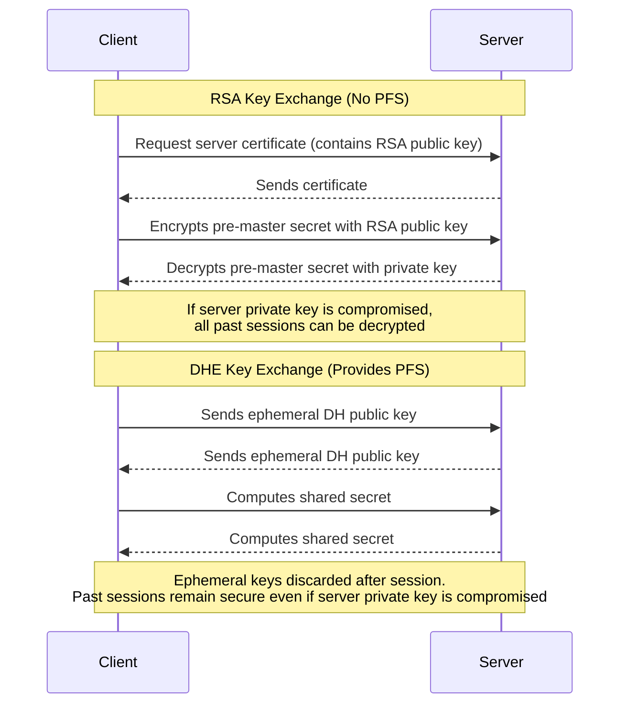

# Perfect Forward Secrecy (PFS) in TLS

## What is PFS?

Perfect Forward Secrecy (PFS) is a security property of cryptographic protocols that ensures session keys cannot be compromised even if the server’s long-term private key is exposed in the future. This protects past communications from being decrypted by attackers who later obtain the server’s private key.

## PFS in TLS 1.3

- TLS 1.3 mandates the use of ephemeral key exchange (DHE/ECDHE), which always provides PFS.
- Static RSA key exchange is not allowed in TLS 1.3.
- It is not possible to use TLS 1.3 without PFS.

## PFS in TLS 1.2

- PFS is possible in TLS 1.2 if ephemeral key exchange methods (DHE/ECDHE) are used.
- If static RSA key exchange is used, PFS is not provided.
- The presence of PFS depends on the cipher suite, not just the protocol version.

## How RSA Key Exchange Works (No PFS)

- The client encrypts a pre-master secret with the server’s RSA public key.
- The server decrypts it with its private key.
- If the server’s private key is compromised, all past sessions can be decrypted.

## How DHE/ECDHE Key Exchange Works (Provides PFS)

- Both parties generate ephemeral key pairs for each session.
- They exchange public keys and compute a shared secret.
- Session keys are derived from this secret and ephemeral keys are discarded.
- Compromise of the server’s private key does not affect past sessions.

## Role of Certificate Algorithms (RSA, ECDSA) in TLS

In modern TLS (1.2 with PFS, 1.3), the algorithm used in the server's certificate (such as RSA or ECDSA) is primarily for authentication:

- The certificate's private key is used to digitally sign handshake messages, proving the server's identity to the client.
- If the certificate uses RSA, the RSA key signs handshake data (and in older TLS, could be used for key exchange, but this does not provide PFS).
- If the certificate uses ECDSA, the ECDSA key signs handshake data.
- The actual key exchange, which establishes the session keys and provides PFS, uses ephemeral algorithms (DHE/ECDHE) that are not tied to the certificate's key.
- The certificate's algorithm is not used to encrypt session data or perform key exchange in modern TLS with PFS.

This separation ensures that even if the server's long-term private key is compromised, past session keys remain secure due to the use of ephemeral key exchange methods.

---

## Sequence Diagram: RSA vs DHE Key Exchange and PFS

---

## Key Takeaways

- PFS protects past communications even if long-term keys are compromised.
- TLS 1.3 always provides PFS; static RSA key exchange is not allowed.
- In TLS 1.2, PFS depends on using DHE/ECDHE cipher suites.
- RSA key exchange does not provide PFS; DHE/ECDHE does.
